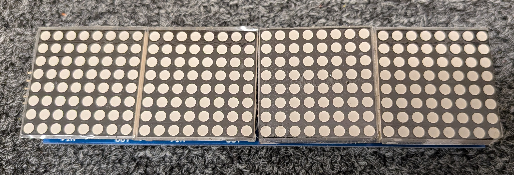

# LED Matrix Panel

## Wiring

??? note "Wiring a Single LED Matrix Panel"

    The LED Matrix panel must be connected to Grove Port 2, which is the one that supports the SPI protocol that is used the panel.

    Wire the five pins of on the LED Matrix Panel as follows:

    * VCC on the LED panel is connected to the 3V3 pin (red wire)
    * GND on the LED panel is connected to the GND pin (black wire)
    * DIN on the LED panel is connected to the GP3 pin (yellow wire)
    * CLK on the LED panel is connected to the GP2 pin (white wire)

    * CS on the LED panel is connected to any other GP pin (for example, GP 6 on Grove Port 5, white wire).  CS stands for Chip Select and is used to select which Panel is being controlled.

??? note "Wiring Multiple Independent LED Matrix Panels"

    If you have multiple independent LED Matrix Panels, they should all share their VCC, GND, DIN, and CLK pins, which should all be wired to Grove Port 2 as described above (under "Wiring a Single LED Matrix Panel).

    However, each LED Matrix Panel will need its CS pin connected to a different GP pin. CS stands for Chip Select and is used to select which Panel is being controlled.

??? note "Wiring Multiple Linked LED Matrix Panels"

    If you have multiple LED Matrix Panels and you want them all to function as a single large grid, then the VCC, GND, CLK, and CS pins should all be wired together.

    The DIN pin of the first (top left) panel should be wired to the GP3 (yellow wire) pin on the board.

    The DIN pin of each subsequent board should be wired the DOUT at the end of the previous board.

## Programming

??? note "Programming a Single LED Matrix Panel"

    * Download the [led_matrix_library.zip](libraries/led_matrix_library.zip) library and extract it into the lib folder on your circuitpy board.
    * Download the [font5x8.bin](libraries/font5x8.bin) font file and copy it to your circuitpy folder (not inside the lib folder)
    * Import the needed libraries:
        * `from adafruit_max7219 import matrices`
        * `import board, digitalio, busio`
    * Configure the SPI interface:
        * `spi = busio.SPI(clock=board.GP2, MOSI=board.GP3)`
        * The `clock` is the pin connected to CLK (should be GP2)
        * The `MOSI` is the pin connected to DIN (should be GP3) 
    * Configure the CS pin:
        * `cs = digitalio.DigitalInOut(board.GP6)`
    * Initialize the Matrix:
        * `matrix = matrices.CustomMatrix(spi, cs, 32, 8)`
        * The 32 is the width of the panel, and the 8 is the height of the panel
    * To set the Brightness:
        * `matrix.brightness(15)`
        * The value of the brightness can range from 0 to 15 (inclusive)
    * Showing your work:
        * After displaying anything, you must call `show` to see the results of your work:
            * `matrix.show()`
    * Filling the panel:
        * To erase the entire panel (every pixel off):
            * `matrix.fill(0)`
        * To turn every pixel on the entire panel on at once:
            * `matrix.fill(1)`
        * Don't forget to use `matrix.show()` to see the results of your work!
    * To control a pixel:
        * To turn a pixel with coordinates (x,y) on:
            * `matrix.pixel(x, y, 1)`  
        * To turn a pixel with coordinates (x,y) off:
            * `matrix.pixel(x, y, 0)`  
        * The x coordinate should be between 0 and 31 (inclusive)
        * the y coordinate should be between 0 and 7 (inclusive)
        * Pixel 0,0 (the origin) is at the top left of the panel
        * You can use a loop to turn on or off manby pixels at once
        * Don't forget to use `matrix.show()` to see the results of your work!
    * To draw a rectangle:
        * `matrix.rect(x, y, width, height, color, fill)`
        * x is the x coordinate of the left edge of the rectangle
        * y is the y coordinate of the top edge of the rectangle
        * width is the width of the rectangle
        * height is the height of the rectangle
        * color is 1 (to turn the pixels in the rectangle on) or 0 (to turn the pixels in the rectangle off)
        * fill is a boolean: True (to draw a filled, solid rectangle) or False (to draw just the outline of the rectangle)
        * Don't forget to use `matrix.show()` to see the results of your work!
    * To draw text:
        * `matrix.text(string, x, y, color)`
        * string is the message to display
        * x is the x coordinate to start drawing the text (usually 0)
        * y is the y coordinate to start drawing the text (usually 0)
        * color is 1 to turn the pixels in the letters on (the default), or 0 to turn the pixels in the letters off
        * Don't forget to use `matrix.show()` to see the results of your work!

??? note "Programming Multiple Independent LED Matrix Panels"

    * Configure each CS (Chip Select) pin:
        * `cs1 = digitalio.DigitalInOut(board.GP6)`
        * `cs1 = digitalio.DigitalInOut(board.GP7)`

    * Initialize each Matrix:
        * `matrix1 = matrices.CustomMatrix(spi, cs1, 32, 8)`
        * `matrix2 = matrices.CustomMatrix(spi, cs2, 32, 8)`

    * Now you can draw on and show each matrix seperately.

??? note "Programming Multiple Linked LED Matrix Panels"

    * Initialize one Matrix with the width and height of the entire grid:
        * For example, four panels in a 2x2 layout would be 64 pixels wide and 16 pixels tall:
        * `matrix = matrices.CustomMatrix(spi, cs, 64, 16)`
