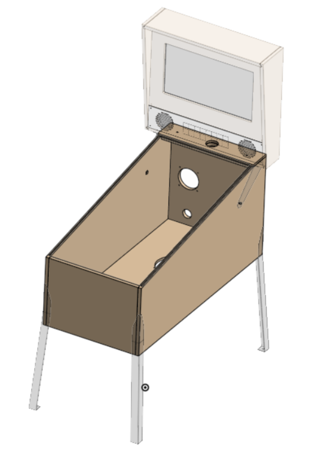

# Cabinet Build

[OnShape CAD model](https://cad.onshape.com/documents/1a48e3676d97d1cf3c542677/w/d0cca8cfcb2c5de28bbc8004/e/02974a60b2c0ee0f009d26a3?renderMode=0&uiState=6a142095744eaece4e04e85d) (navigate to "Pinball Assembly" tab)

!!! note "Assembly Notes"

    Wood glue should be cleaned up with a damp paper towel as you assemble.
    
    Always test fit parts **first**
    
    Ask for guidance if you are unsure at any point!

## Assemble Box

{ width="200" }

* Test fit all panels.
* Glue the backbox shelf and spacer assembly and clamp to dry.
* Glue front, left, and rear panels together, then glue in the bottom and finally the right panel. 
* Glue on backbox shelf and spacer assembly
* Clean up any remaining glue, then clamp and let dry.

## Attach Legs

* Mark leg and hole positions and file a small flat for the drill bit.
* Glue in internal corner spacers. Clean up excess glue.
* Use drill template to drill leg holes.  before drill the hole through the jig.
* Hand-tighten the internal brackets with the leg bolts, then drill pilot holes for internal brackets.
* Drill pilot holes into spacers and screw brackets to those.
* Fasten each leg by first positioning a cabinet protector before bolting on the leg with two 3/8"-16 x 2.5" bolts.
* Install leg levelers.

## Install Glass Rails / Protectors

## Electronics

### External Buttons

### Power Strip

### PC

### Audio Components

### 48v Power Supply

## Attach Backbox

## Painting / Artwork

## Install Playfield
