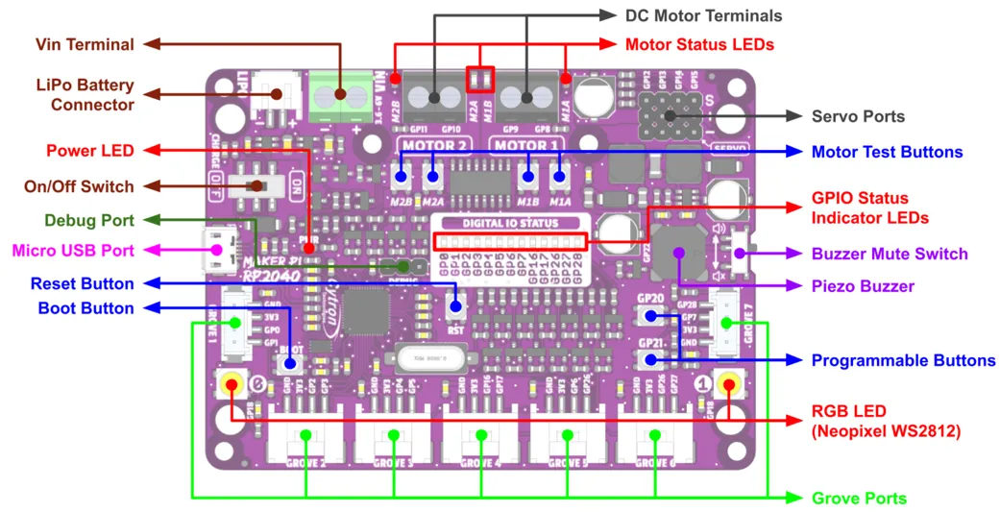
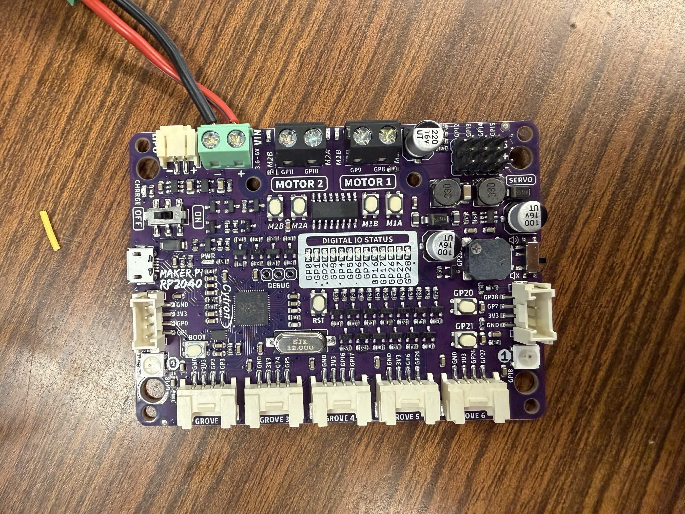

# The Circuit Board

## Notable parts
* Vin Terminal
    * Where the cable for power will plug in
* Parts of the grove ports
    * 3V3 = Power
    * GND = Ground
    * GP# = Input or Output
* Parts of the servo ports
    * "+" = Power
    * "-" = Ground
    * S = Signal (What you would plug in to GP ports on the grove ports)

## Resources
