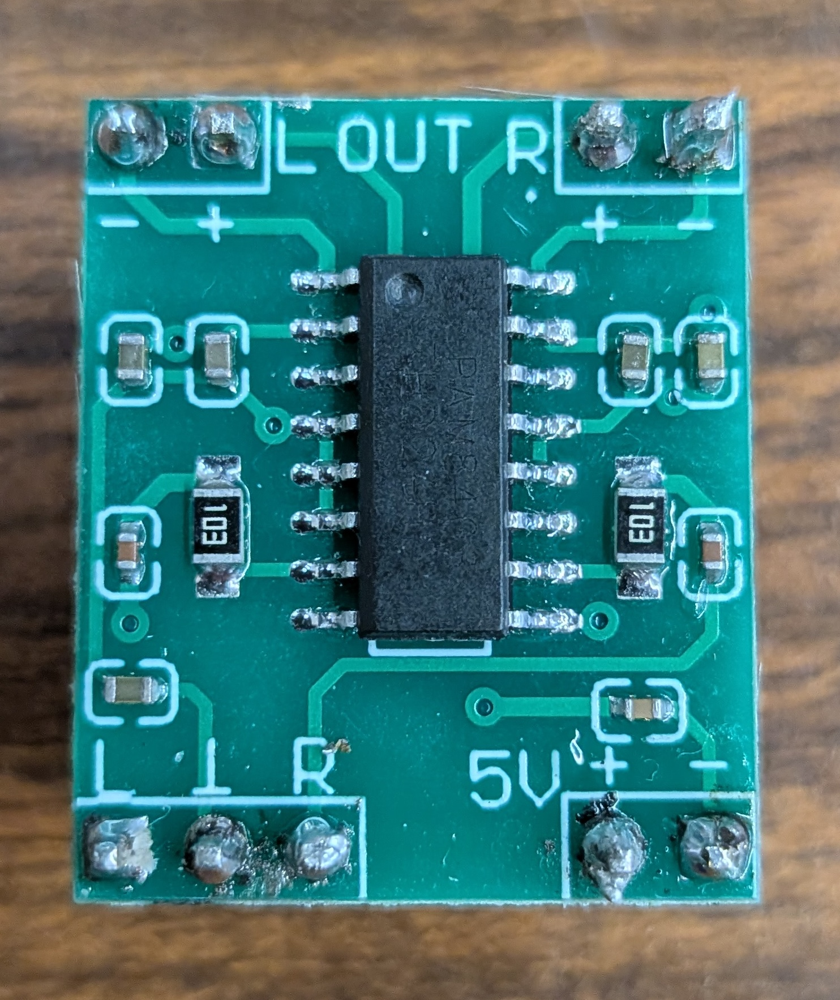

# Music and Sound

??? note "Using the Built-in Piezo Buzzer"

    * Our boards have a built-in piezo buzzer, so you can get simple sounds and some music without any additional wiring needed.
    * The built-in piezo buzzer is connected to pin GP22
    * There is a Buzzer Mute Switch next to the buzzer on the right edge of the board, which you can use to turn off the buzzer if it gets annoying.

??? note "Connecting an External Amplifier and Speaker"

    

    * The audio amplifier doesn't have pins connected to it, so you will need to solder breakaway pins to be able to connect it to the circuit board.
    * Connect the 5V+ pin to a 5 Volt power source (such as one of the Servo + pins)
    * Connect the 5V- pin to ground (either the Servo - pin or a Grove GND pin)
    * Connect the &perp; pin (between the bottom L and R) to ground (either the Servo - pin or a Grove GND pin)
    * Connect the bottom R pin to the GP pin that you will use for playing audio (can be either a Servo S pin or a Grove GP pin)
    * Connect the Out R + pin to the red wire on the speaker
    * Connected the Out R - pin to the black wire on the speaker

??? note "Programming for Simple Tones and Notes"

    * Download the [music.py](libraries/music.py) library (read library for more detailed documentation)
    * Import the libraries:
      * `import board, music`
    * Pick an output source
      * If you're using the built-in piezo buzzer, use GP22
      * If you're using an external amplifier and speaker, use the GP pin you used for the aplifier
    * Play a single tone with a given frequency (in hertz), duration (in seconds), volume (0..100):
      * `music.playTone(board.GP22, 440, 0.25, 50)`
    * Play a series of tones from the given list of frequencies, duration (in seconds), volume (0..100):
      * `music.playTones(board.GP22, [400, 500, 600], 0.25, 50)`
    * Play a single musical note, with a given letter note from 'A' to 'G', or sharp (like 'A#') or flat (like 'Ab'), and a given octave number (usually in the range 1..9), and duration (in seconds), volume (0..100):
      * `music.playNote(board.GP22, 'A', 4, 0.25, 50)`
    * Play a series of musical notes from a list, where each note in the list is a (letter, octave, duration) tuple, and volume is in the range 0..100:
      * `music.playNotes(board.GP22,[('B',4,0.25),('C',5,0.25),('G',5,0.25)],50)`

??? note "Play Music from a WAV audio file"

    * Note: You will probably need to edit/convert your WAV file before playing it.
    * We recommend using the excellent free program [Audacity](https://www.audacityteam.org) to edit/convert WAV files
    * Export your WAV file with these settings:
        * Mono channel (not stereo)
        * The encoding should be either Unsigned 8-bit PCM or Signed 16-bit PCM 
        * You might need to use a lower sample rate (try 16000)
    * Import pre-installed libraries:
        * `import board, audiocore, audiopwmio`
    * Load the music file:
        * `music = audiocore.WaveFile("my_wav_file.wav")`
    * Configure audio (on our boards, the piezo buzzer is GP pin 22):
        * `audio = audiopwmio.PWMAudioOut(board.GP22)`
    * Play the music file once:
        * `audio.play(music)`
    * Play the music file on repeat:
        * `audio.play(music, loop=True)`
    * See reference documentation for the [audiocore](https://docs.circuitpython.org/en/latest/shared-bindings/audiocore) and [audiopwmio](https://docs.circuitpython.org/en/latest/shared-bindings/audiopwmio) libraries 

??? note "Play Music from a MP3 audio file"

    * Note: You will probably need to edit/convert your MP3 file before playing it.
    * We recommend using the excellent free program [Audacity](https://www.audacityteam.org) to edit/convert MP3 files
    * Export your MP3 file with these settings:
        * Mono channel (not stereo)
        * Constant Bit Rate Mode (not preset, variable, or average)
        * Lower Sample Rate (try 11025, other values may work too)
        * Lower Quality (try 32 kbps, other values may work too)
    * Import pre-installed libraries:
        * `import board, audiomp3, audiopwmio`
    * Load the music file:
        * `music = audiomp3.MP3Decoder("my_mp3_file.wav")`
    * Configure audio (on our boards, the piezo buzzer is GP pin 22):
        * `audio = audiopwmio.PWMAudioOut(board.GP22)`
    * Play the music file once:
        * `audio.play(music)`
    * Play the music file on repeat:
        * `audio.play(music, loop=True)`
    * See reference documentation for the [audiomp3](https://docs.circuitpython.org/en/latest/shared-bindings/audiomp3) and [audiopwmio](https://docs.circuitpython.org/en/latest/shared-bindings/audiopwmio) libraries

??? note "Using Mixers for music"

    * You can use mixers along with MP3 or WAV files to play mix them or change the volume
    * Initialize music and audio like how you would when playing them normally
    * Initialize the mixer
        * `mixer = audiomixer.Mixer(voice_count, sample_rate, channel_count, bits_per_sample, samples_signed)`
    * Play the mixer using the audio
        * `audio.play(mixer)`
    * Play the music using the mixer
        * `mixer.voice[index].play(music)`
        * index: what voice you want to use for that mixer
    * Change volume of music
        * `mixer.voice[index].level = 0.5`
        * Takes decimal values between 0 and 1, 0 being muted and 1 being full volume.
