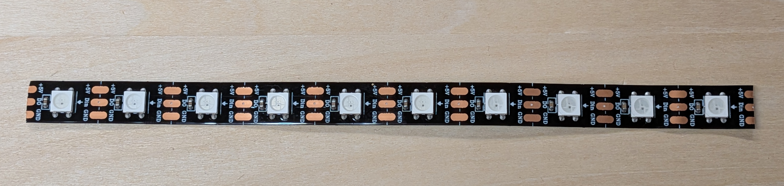

# NeoPixel LEDs

NeoPixels are LED lights that can display programmable colors, using any combination of red, green, and blue (RGB) light.

??? note "Wiring NeoPixels"

    * You will need to solder wires to the end of your NeoPixel strip.
    * It is easiest to use a Servo connector for your NeoPixels.
    * Connect the 5V pad to one of the Servo + pins
    * Connect the GND pad to one of the Servo - pins
    * Connect the Din (digital-in) pad to one of the Servo S pins
    * NeoPixel strips can cut along the white lines that divide the solder pads in half

??? note "Programming NeoPixels"

    * Import pre-installed libraries:
        * `import board, neopixel`
    * Initialize with pin and number of attached pixels
    * For example, to control the two NeoPixels built in to our Cytron Maker Pi RP20240 board:
        * `pixels = neopixel.NeoPixel(board.GP18, 2)`
    * Use as if it were a list of (R,G,B) tuples
        * `pixels[0] = (255,0,0) # red`
        * `pixels[1] = (255,255,255)  # white`
    * Set all pixels to same color with `fill` function:
        * `pixels.fill((0,255,0)) # all set to green`
    * See reference documentation for the [neopixel](https://docs.circuitpython.org/projects/neopixel/en/latest/api.html) library
