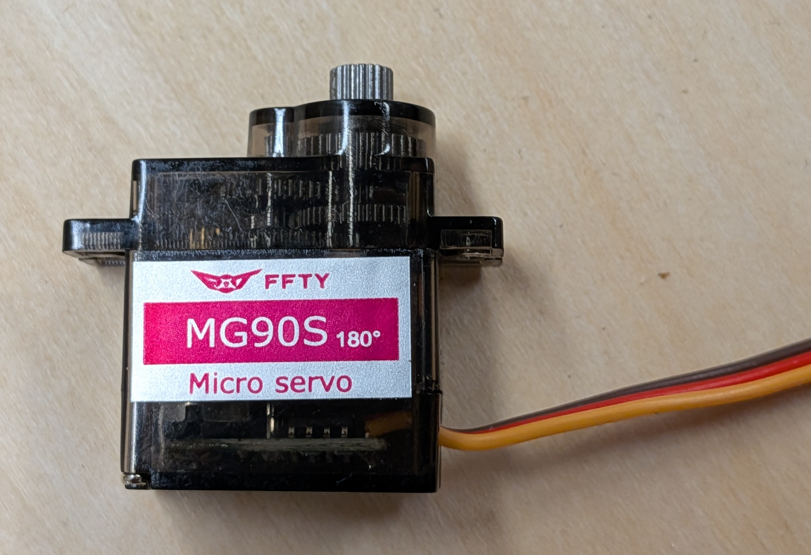

# Servo Motors

A Servo Motor is a small motor that can rotate to a specified angle and stop.

??? note "Wiring a Servo"

    * Connect the Red wire to a Servo + pin
    * Connect the Black or Brown wire to a Servo - pin
    * Connect the Orange or Yellow wire to a Servo S pin

??? note "Programing a Servo"

    * Import pre-installed libraries:
        * `import board, pwmio`
        * `from adafruit_motor import servo`
    * Configure a PWM outout:
        * `pwm = pwmio.PWMOut(board.GP15, frequency=100)`
        * Use the GP pin number that corresponds to where you connected your servo to the control board
    * Configure the servo:
        * `servo1 = servo.Servo(pwm, min_pulse=500, max_pulse=2500)`
    * Set the servo to a desired angle:
        * `servo1.angle = 90`
        * The angle can range from 0 to 180, inclusive