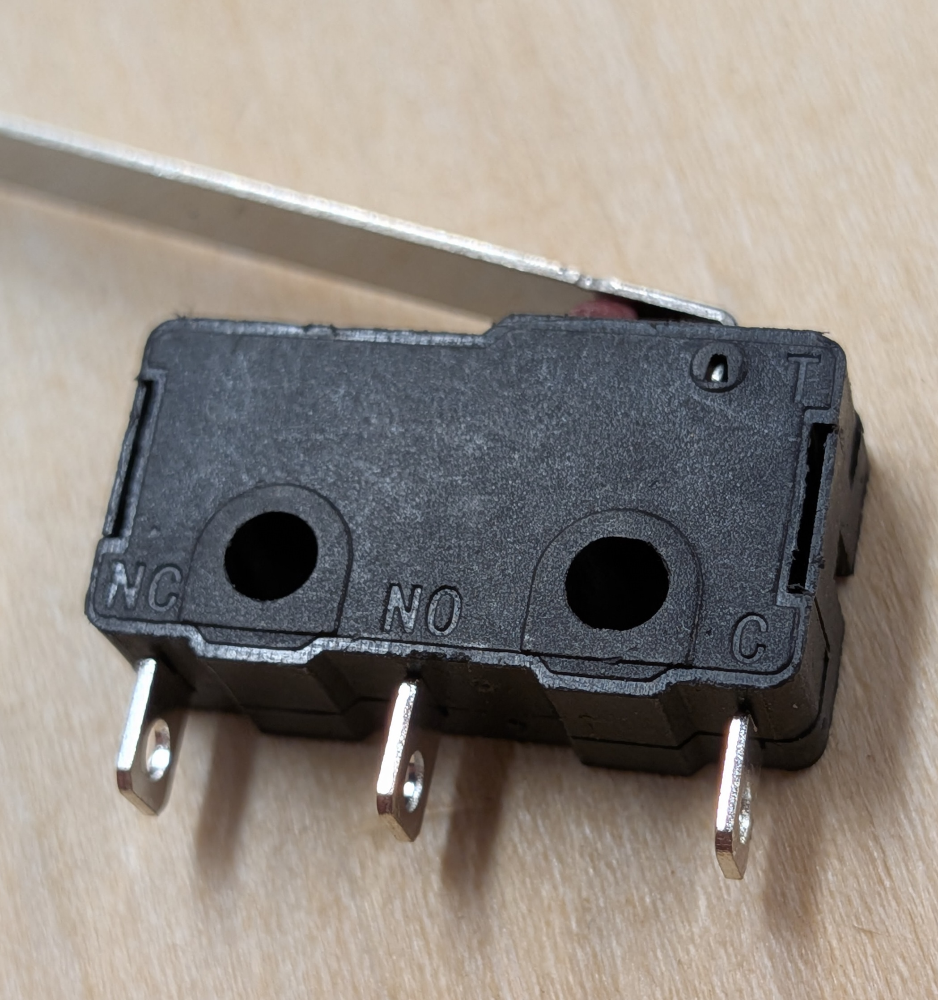
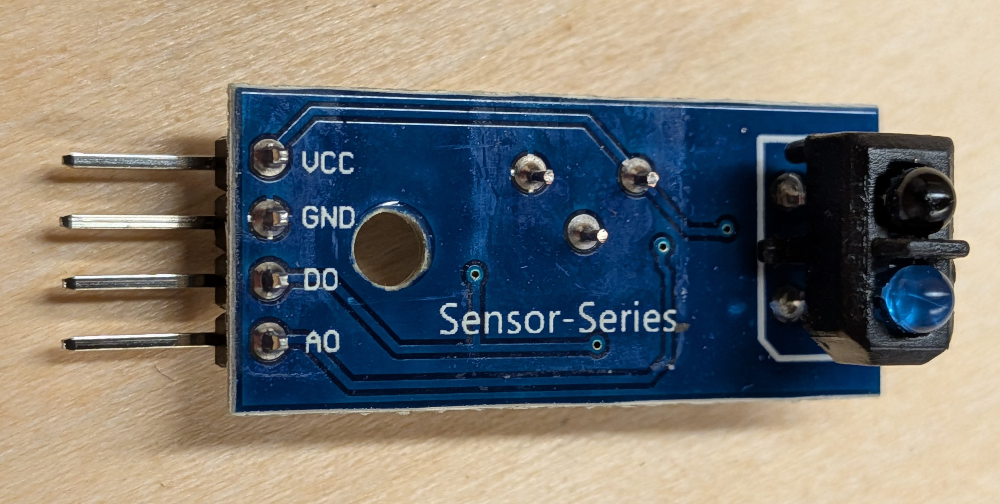

# Switches and Digital Inputs

??? note "Programming for Digital Inputs with Polling"

    Polling a Digital Input will tell if an input is on at the moment, but might miss or double-count events.

    * Import pre-installed libraries:
        * `import board, digitalio`
    * `Attach to one of the General Purpose Input/Output (GP) pins (GP0, GP1, ...):
        * `button1 = digitalio.DigitalInOut(board.GP1)`
    * Set input mode:
        *  `button1.direction = digitalio.Direction.INPUT`
    * Set the input to Pull Up mode:
        * `button1.pull = digitalio.Pull.UP`
    * You can check the current state of the input:
        * `if button1.value == False:   # good choice for Pulled Up input buttons`
    * See reference documentation for the [digitalio](https://docs.circuitpython.org/en/latest/shared-bindings/digitalio) library

??? note "Using the Built-in Buttons"

  * There are two built-in input buttons on our Cytron boards.
  * They are connected to the GP20 and GP21 pins.
  * They are automatically in Pull Up mode (so you don't need to pull them up yourself)
  * The button will noramlly have a value of True, and will change to False when pressed 

??? note "Using a Mechanical Microswitch"

  

  * Connect the C (Common) pin to GND (Ground)
  * Connect the NO (Normally Open) pin to a GP pin
  * Configure that GP pin as a Input in Pull Up mode
  * The switch will normally have a value of True, and will change to False when pressed

??? note "Using an Optical Proximity Switch"

  

  * This will sense if something (like the pinball) is close to the sensor
  * Connect the Vcc pin to a 3v3 (red) wire from a Grove connector
  * Connect the GND pin to a GND (black) wire from a Grove connector
  * Connect the DO (Digital Out) pin to a GP pin (white or yellow) from a Grove connector
  * Do not connect the AO pin to anything
  * The switch will normally have a value of True, and will change to False when something (like a pinball) is near it

